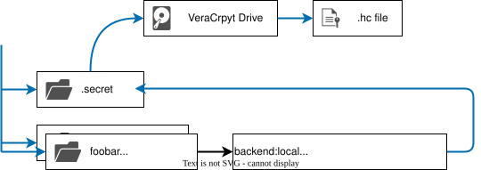

# Startup

## 1. Init encrypt drive



```sh
# install veracrypt
pushd /tmp
wget https://launchpad.net/veracrypt/trunk/1.26.20/+download/veracrypt-console-1.26.20-Debian-12-amd64.deb
# echo "c5c6a3b7032f024203a0096a3bb9d6be509ddb14300813d12c4c9731b000dc18  veracrypt-console-1.26.20-Debian-12-amd64.deb" | shasum -a256 -c
sudo apt install -y ./veracrypt-console-1.26.20-Debian-12-amd64.deb
rm ./veracrypt-console-1.26.20-Debian-12-amd64.deb
popd

# mkdir .secret mountpoint
mkdir .secret

# create container
veracrypt --create secret.hc --size=10MiB --volume-type=normal --encryption=aes --hash=sha-256 --filesystem=ext4 --pim=1453 --keyfiles="" --random-source /dev/random

# mount container
veracrypt --mount secret.hc ./.secret --pim=1453 --keyfiles="" --volume-type=normal --protect-hidden=no
sudo chown "$USER:$USER" secret

# unmount container
veracrypt -d secret.hc

# backup container
mkdir -p /mnt/geektr-secret/VeraCrypt/github.com/geektr-cloud/bigbang
cp secret.hc /mnt/geektr-secret/VeraCrypt/github.com/geektr-cloud/bigbang/secret-$(date '+%Y%m%d-%H%M%S').hc
```

## 2. Init secret files

manual create creds file `cloudflare.yaml` and `aliyun.yaml` in `.secert/public`

```sh
terraform apply -var "base_domain=geektr.co"
```
